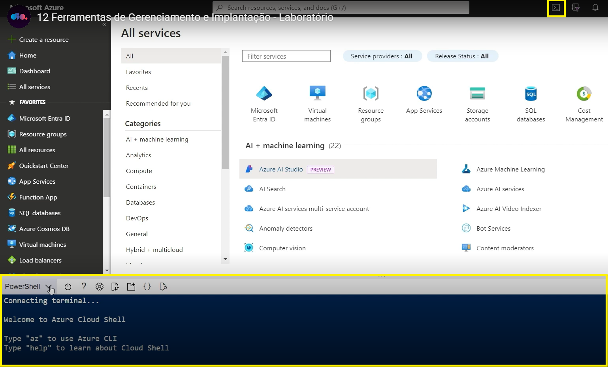
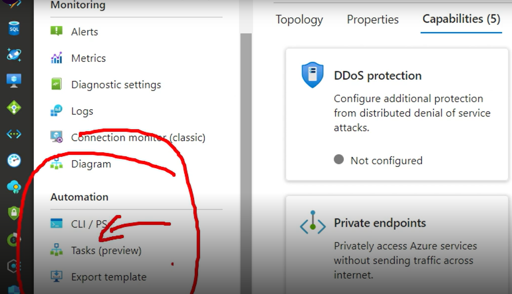
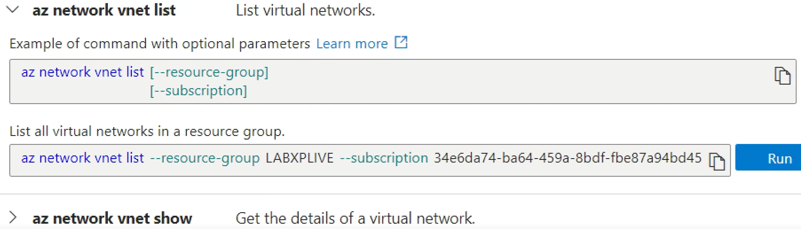
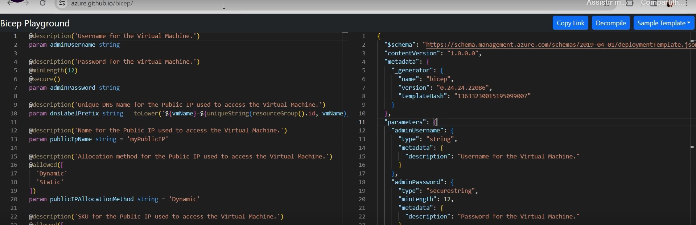
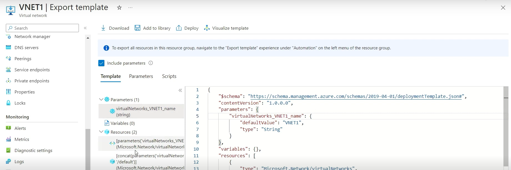
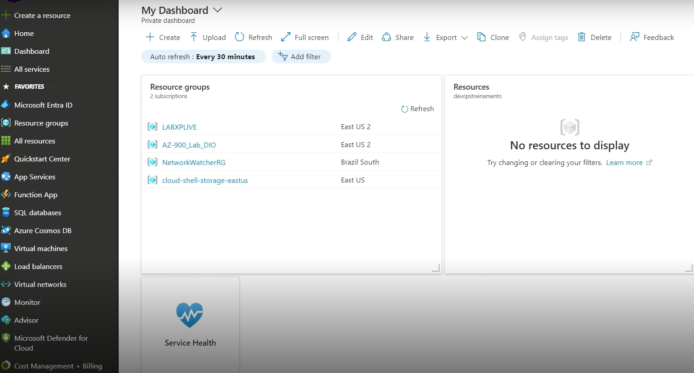
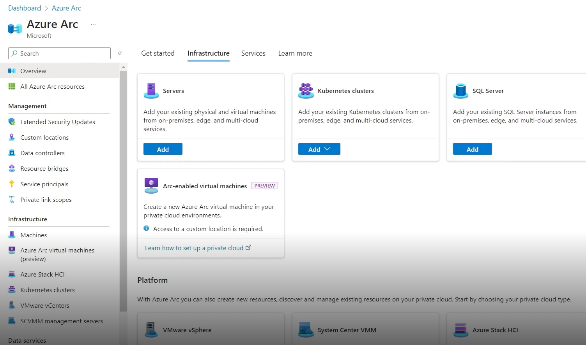
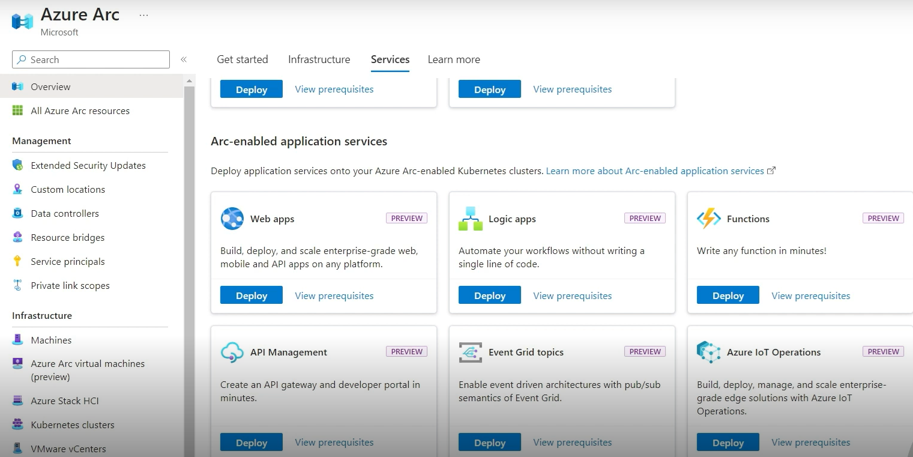

# ☁️ FERRAMENTAS DE IMPLANTAÇÃO NO AZURE
 

  

---  
## ⏯️ INTRODUÇÃO  

Neste laboratório do bootcamp <i>Azure Essencials</i>, foram abordadas questões referentes ao gerenciamento de implantação de recursos no portal <a href='https://portal.azure.com/'><i>Microsoft Azure</i></a>. Através do projeto, foram exploradas ferramentas de automação, além do gerenciamento de recursos Azure e multicloud. 
     

--- 
## 🗒️RESUMO DOS TÓPICOS:  

- A criação de recursos no portal Azure não exige o uso de linhas de comando. Tudo é feito de modo intuitivo através da seleção do tipo de recurso desejado, preenchimento dos dados obrigatórios e espera da finalização da criação pela plataforma..
    

   

  

- Para criação em lote de recursos, fazer essa tarefa manualmente pode ser desvantajoso. A solução está no botão Cloud Shell para ativar a área do terminal de linhas de comando do Azure, com opções de usar Power Shell ou Bash. É necessário ter uma storage account para usar essa ferramenta. Depois de confirmar a existência da conta, são carregados os comandos.
   

  
  

  

- O Power Shell possui botões para criar arquivos, abrir uma nova tela, fazer upload e download. Há mensagens com instrução sobre comandos como “az” para usar Azure Cli e “help” para aprender sobre Cloud Shell, onde há explicações sobre o funcionamento de cada comando. Ao usar o “az”, o terminal começa a autocompletar a digitação da linha de comando. 
      

  
  

  

- O trabalho na função de gerenciamento de recursos do Azure pode ser feito com diversas ferramentas, como o próprio Portal Azure, Azure Cli, Power Shell, Bash. É preciso saber interpretar como os recursos são criados, suas funcionalidasdes e entender também que não é preciso ser dependente do portal para criar os recursos. Se a demanda é extensa, pode ser mais útil adotar modelos ou templates. Por exemplo, acessando as propriedade de um recurso de VNET já criado, no menu lateral há botões para automações, como: CLI/PS (Power Shell), Tasks, Export Templates.  
  

  

  

- CLI é uma interface de linhas de comando do Azure em um conjunto de comandos usados para criar e gerenciar recursos Azure; no portal são disponibilizadas explicações sobre a sintaxe dos comandos e euso de variáveis. O mesmo vale para a utilização de Power Shell. 
    

  

  

- Exportar Template traz informações que podem ser aproveitadas na criação de recursos (como uma VNET), oferece  itens como template em JSON, parâmetros e scripts. Tendo em vista que pode ser extensa a quantidade de linhas de comando, a automação para criar recursos com Bicep facilita o trabalho por usar menos comandos.
  

 

    

- Bicep é mantido por comunidade e não pertence à Microsoft, disponibiliza a área Bicep Playground para comparar comandos do Bicep com outros em linguagens de programação diferentes. Comparado a comandos em JSON para criar uma VNET, a versão do Bicep usa menos linhas de comandos. 
  

   

 

- Azure Arc é uma ferramenta poderosa para gerenciamento multicloud, disponibilzado para todas as assinaturas, mas deve ser configurado para uso. A cobrança está assocado ao deploy de cada recurso trazido para o ambiente. É voltado ao acompanhamento de Servidores, clusters Kubernets, Servidores SQL, máquinas virtuais, plataformas, além de possibilitar a habilitação de serviços fora do Azure e a administração de recurso do Azure por fora dele. 
 

  

- Não existe outra plataforma similar no mercado para concorrer com Azure Arc de propriedade da Microsoft. Sugestão de prática: criar um recuso na nuvem AWS, seguir os passos para adicioná-lo com o Azure Arc. 
   

  
 

  

---    
## ✍️ AUTORA    

Carla Edila Silveira  
Contato: rosa.carla@pucpr.edu.br  

---  
## ©️ LICENÇA

[MIT](https://choosealicense.com/licenses/mit/)  

---  
## 🔗 LINKS ÚTEIS  

- [Bicep](https://azure.github.io/bicep/)
- [Azure Arc](https://azure.microsoft.com/pt-br/products/azure-arc)
- [Documentação da CLI (Interface de Linha de Comando) do Azure](https://learn.microsoft.com/pt-br/cli/azure/)
  
---
